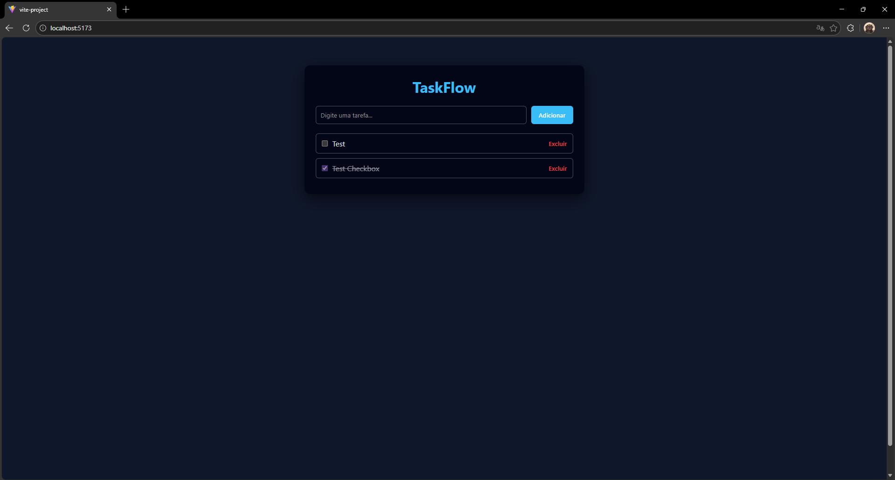

# TaskFlow + Responsive Layout

Um aplicativo simples de gerenciamento de tarefas, projeto full-stack desenvolvido com Node.js, Express, SQLite e React.

## Funcionalidades

- Criar tarefas
- Listar tarefas
- Marcar como concluídas
- Excluir tarefas
- Layout responsivo e visual moderno

## Tecnologias

**Frontend**
- React (Vite)
- CSS puro

**Backend**
- Node.js
- Express
- SQLite

## Screenshots

## Como rodar o projeto

### Backend - http://localhost:3001
cd backend
npm install
node index.js

### Frontend - http://localhost:5173
cd frontend
npm install
npm run dev